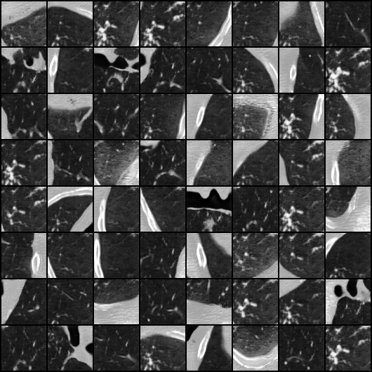

# Supporting Code for *Evaluation of 3D GANs for Lung Tissue Modelling in Pulmonary CT* by Ellis et al, 2022

This repository contains code to train and analyse three families of GAN models for healthy lung tissue modelling, as described in '*Evaluation of 3D GANs for Lung Tissue Modelling in Pulmonary CT*' by Ellis et al. Journal of Machine Learning for Biomedical Imaging. 2022. (link to follow)

This project builds heavily on pre-existing code, such as the official PyTorch [DCGAN implementation](https://github.com/pytorch/examples/blob/main/dcgan/main.py) and the [bigGAN code](https://github.com/ajbrock/BigGAN-PyTorch) released by Brock et al. The 3D FID component of the analysis relies on the pretrained 3D MedicalNet by Chen et al, available [here](https://github.com/Tencent/MedicalNet).

## Requirements

Requirements are provided in the accompanying `requirements.yml` file. 

## Instructions for use

### Set-up

There are a number of steps that need to be followed before the GAN training code can be run.

1. The LUNA16 data must be downloaded [here](https://luna16.grand-challenge.org/Download/) and the raw CT images stored such that all subsets are held in the same folder. E.g. the data folder is called `/path/to/LUNA16/`, which contains 10 subfolders `subset0`, `subset1`, etc.
2. The seg-lungs-LUNA16.zip must be unzipped and stored as one directory separate to the raw CT images, e.g. `/path/to/seg-lungs-LUNA16/`.
3. Run the `filter_and_split_LUNA16.py` file, pointing it to your saved LUNA16 images and segmentations. This discards scans classed as malignant, and splits the remaining scans into 80:20 train:test.

        python filter_and_split_LUNA16.py --image_path /path/to/LUNA16/ --lung_seg_path /path/to/seg-lungs-LUNA16/
        
4. Run the `precalculate_real_FID_statistics.py`, which saves the real data's activation statistics as required for FID calculation.

        python precalculate_real_FID_statistics.py --cudaDevice 0

### Training a GAN model

Now we are ready to train a GAN model. There are many hyperparameters that can be specified, run `python train_GAN.py --help` for details. Here is one example, running a DCGAN model with the minibatch discrimination (MDmin) described in the paper, calculating FID throughout the training:

        python train_GAN.py --cudaDevice 0 --MDmin True --genModel DCGAN --fidFlag True

The results will be stored in a directory describing the method, e.g. `DCGAN_MDmin_relativistic/`, in a time-stamped subfolder allowing multiple runs.

The results folder will contain the following:

- `args.txt`: a copy of the used args
- `allErrD.txt`, `allErrG.txt`: the average discriminator and generator losses, outputted at the end of training for each patient
- `allFID.txt`, `allLabels.txt`: the FID score measured every 200 patients and at the end of each epoch (pass through all patients), and the corresponding labels (in the format epoch{ep}_{patient})
- `bestFID.txt` and `bestFID_epoch.txt`: the lowest recorded FID and the epoch,patient number this was measured at
- `fake_samples_*`, `real_samples_*`: generated and real samples from throughout the training
- `netD_best.pth`, `netG_best.pth`, `netD_curr.pth`, `netG_curr.pth`: the state of the models at both the minimum FID and the current epoch (gets updated throughout training)

### Model analysis

The following additional model analyses can be performed:

- `samples_and_interp_from_GAN.py` produces 2D samples and interpolations from a provided GAN model. Results are saved in the same location as the invoked genereator model, in subdirectories `samples` and `samples_interp`. Example use:

        python samples_and_interp_from_GAN.py --netG ./path/to/netG_best.pth --genModel DCGAN
        
- 3D branch point analysis can be performed with the `branch_stats_real.py` and `branch_stats_GAN.py` scripts:
    - `branch_stats_real.py` loads and calculates the number of 3D branch points for real image patches. The results are saved in the file `real_branch_stats.txt` where each line is the number of branch points recorded for a single real sample patch.
    - `branch_stats_GAN.py` uses the specified GAN model to generate patches and calculates the number of 3D branch points per patch. The resulting distribution is saved in the model folder, in the subfolder `branch_stats_3D/`.
    - the resulting distributions can be visualised and compared as necessary.

- 3D FID calculation is performed with the `fid3D.py` script, which uses the `Med3D` folder. 3D FID calculation can be performed as follows:
    1. create a folder called `pretrain` in the Med3D folder.
    2. download the pretrained 3D resnet(s) as indicated [here](https://github.com/Tencent/MedicalNet) and save the models in the `pretrain` folder made in step 1. We use the `resnet_10_23dataset.pth` model, but if required this can be manually changed in the `fid3D.py` file on line 20.
    3. pre-save the real 3D samples by running `save_real_3D_samples_FID.py`. This creates a folder `real_samples_3D_FID` which contains batches of real images as `.pth` files. These are loaded when calculating 3D FID.
    4. run `fid3D.py`, supplying the generator model to be evaluated. The results will be saved in the results folder for that model. Example usage:
    
            python fid3d.py --netG /path/to/netG_best.pth --genModel DCGAN
            
- UMAP analysis is provided for styleGAN models. To perform:
    1. run `styleGAN_UMAP_1.py`. This takes random samples of z, maps into w-space and saves the results. In addition, for a smaller example set, it generates images and calculates and the number of branch stats per image. These are all saved in a `UMAP_visualisation` subfolder in the model results folder.
    2. run `styleGAN_UMAP_2.py`. This loads the latent space w, performs the UMAP embedding, and plots the embedded space, colour coded by the branch statistics calculated in step 1 (similar to Fig. 10 in the manuscript). IMPORTANT: due to incompatibilities between libraries, this step **__must__** be performed in a separate python enviroment, defined by the `umap.yml` file. 
       
